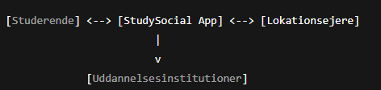
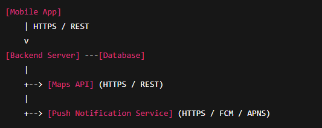

# Table of contents
1. [Chapter 1: Introduction and Goals](#chapter-1-introduction-and-goals)
2. [Chapter 2: Architecture Constraints](#chapter-2-architecture-constraints)
3. [Chapter 3: Context and Scope](#chapter-3-Context-and-Scope)
4. [Chapter 4: Solution Strategy](#chapter-4-Solution-Strategy)
5. [Chapter 5: Building Block View](#chapter-5-building-block-view)
6. [Chapter 6: Runtime View](#chapter-6-runtime-view)
7. [Chapter 7: Deployment View](#chapter-7-deployment-view)
8. [Chapter 8: Cross-cutting Concepts](#chapter-8-cross-cutting-concepts)
9. [Chapter 9: Architecture Decisions](#chapter-9-architecture-decisions)
10. [Chapter 10: Quality Requirements](#chapter-10-quality-requirements)
11. [Chapter 11: Risks and Technical Debts](#chapter-11-risks-and-technical-debts)
12. [Chapter 12: Glossary](#chapter-12-glossary)

# Chapter 1: Introduction and Goals
Unibar Locator er en mobilapplikation, der henvender sig til studerende med det formål at fremme sociale interaktioner. Applikationen præsenterer både kort- og listevisning af nærliggende lokationer og giver yderligere information om prisniveau, antal tilstedeværende studiekammerater, brugervurdering samt rutevejledning. Den er designet til at styrke det sociale liv blandt studerende, øge trivsel og reducere frafald fra uddannelserne.

## Requirements Overview
| ID | User stories | Requirements |
| --- | -------- | ------- |
| US1 | Som studerende ønsker jeg en oversigt over alle lokationer der serverer alkohol, for at have et nemt overblik. | Applikationen skal vise en liste eller et kort med tilgængelige lokationer. |
| US2 | Som studerende vil jeg kunne vælge rute via maps, så jeg hurtigere kan finde vej. | Applikationen skal understøtte integration med korttjenester for at vise vej. |
| US3 | Som studerende ønsker jeg et anslået prisleje på hver location, så jeg kan vælge ud fra min saldo. | Applikationen skal fremvise et prisestimat ved hver location. |
| US4 | Som studerende vil jeg kunne se hvor mine venner er, så vi nemmere kan finde hinanden. | Applikationen skal understøtte visning af venners tilstedeværelse på lokationer. |
| US5 | Som studerende vil jeg kunne give hver location en rating, så jeg nemmere kan sorterer i mulighederne. |  Brugere skal kunne vurdere og bedømme lokationer. |

**Form**  
Se funktionelle krav gennem user stories. (USandFK.md)

## Quality Goals

**Motivation for interessenter**
| Interessent         | Kvalitetsmål                                                                 |
|---------------------|-------------------------------------------------------------------------------|
| **Uddannelsesinstitution** | - Appen skal understøtte sociale relationer og reducere frafald. - Privatliv og sikkerhed skal være garanteret for at beskytte institutionens omdømme. |
| **Lokationsejere**  | - Information om lokationer skal være korrekt og nem at opdatere. |
| **Studerende**      | - Skal kunne finde lokationer og rutevejledning første gang uden introduktion. - Lokationsoversigt skal indlæses på under 2 sekunder. - Venne-funktion skal fungere stabilt og pålideligt. - Deling af lokation/persondata skal altid være frivillig og let at slå fra. |

**Funktionelt krav og kvalitetsmål**
| Funktionelt krav | Relateret kvalitetsmål |
|------------------|-------------------------|
| F1 – Kort med nærliggende lokationer | Brugervenlighed, Ydelse |
| F2 – Liste sorteret efter afstand | Brugervenlighed, Ydelse |
| F3 – Integration med Maps | Brugervenlighed, Tilgængelighed |
| F4 – Fremvise rute til lokation | Brugervenlighed |
| F5 – Fremvise prisleje | Brugervenlighed |
| F6 – Sortere lokationer efter prisleje | Brugervenlighed |
| F7 – Fremvise venners placering i realtid | Pålidelighed, Privatliv |
| F8 – Slå deling af placering til/fra | Privatliv, Sikkerhed |
| F9 – Fremvise rating-system | Brugervenlighed |
| F10 – Gennemsnitlig rating | Brugervenlighed |
| F11 – Sortere lokationer efter rating | Brugervenlighed |
| F12 – Give brugere mulighed for at rate | Brugervenlighed, Pålidelighed |

## Stakeholders 
| Stakeholder                       | Rolle / Beskrivelse                                    | Behov / Interesse i systemet                                                        |
|-----------------------------------|--------------------------------------------------------|-------------------------------------------------------------------------------------|
| Studerende                        | Primære brugere af appen                               | Overblik over sociale aktiviteter, brugervenlighed, sociale funktioner, prisniveau  |
| Lokationsejere                    | Ejere af lokationer der serverer alkohol               | Synlighed, korrekt information, mulighed for at opdatere indhold                    |
| Uddannelsesinstitution            | Videregående uddannelsessteder                         | Data om deltagelse, fremme trivsel, integration med eksisterende systemer           |
| Systemadministrator / IT-team     | Ansvarlig for drift og vedligeholdelse                 | Arkitekturforståelse, dokumentation, sikkerhed og stabilitet                        |
| Udviklingsteam                    | Implementering og videreudvikling                      | Detaljeret arkitektur, kodebase, dokumentation, beslutningsinput                    |
| Designere / UX-ansvarlige         | Ansvarlige for brugeroplevelse                         | Forståelse af funktioner og begrænsninger, input til arkitekturvalg                 |
| Marketing / Kommunikation         | Promovering af appen                                   | Information om funktioner, brugerdemografi, branding                                |
| Eksterne tjenesteudbydere         | Korttjenester, notifikationer, betalingsgateways       | API-adgang, tekniske krav, kompatibilitet                                           |
| Forældre / værger (indirekte)     | Bekymrede for studerendes sikkerhed og trivsel         | Informationssikkerhed og datahåndtering                                             |

# Chapter 2: Architecture Constraints

::: formalpara-title
**Contents**
:::

Any requirement that constraints software architects in their freedom of
design and implementation decisions or decision about the development
process. These constraints sometimes go beyond individual systems and
are valid for whole organizations and companies.

::: formalpara-title
**Motivation**
:::

Architects should know exactly where they are free in their design
decisions and where they must adhere to constraints. Constraints must
always be dealt with; they may be negotiable, though.

::: formalpara-title
**Form**
:::

Simple tables of constraints with explanations. If needed you can
subdivide them into technical constraints, organizational and political
constraints and conventions (e.g. programming or versioning guidelines,
documentation or naming conventions)

See [Architecture Constraints](https://docs.arc42.org/section-2/) in the
arc42 documentation.

# Chapter 3: Context and Scope

## Business Context
Systemet, Unibar locator, er en mobilapplikation, der forbinder studerende med nærliggende lokationer og medstuderende for at fremme sociale interaktioner. Systemet fungerer som en “black box” mellem brugere, lokationsejere og institutioner, hvor det modtager forespørgsler, processerer data og leverer relevant information.

### Business Context Diagram

### Domain Interfaces Table

| Communication Partner        | Inputs from Partner                                      | Outputs to Partner                                                                 |
|-------------------------------|----------------------------------------------------------|----------------------------------------------------------------------------------|
| Studerende                    | Søgeforespørgsler, rutevalg, rating, venneplacering     | Liste/kort med lokationer, rutevejledning, venners placering, prisestimat, ratings |
| Lokationsejere                | Opdatering af lokationsinformation (åbningstid, priser)  | Bekræftelse af opdatering, statistik over besøg                                    |
| Uddannelsesinstitution        | Ingen direkte input                                      | Anonymiseret data om deltagelse, sociale mønstre                                   |
| Eksterne tjenester (Maps API) | Lokationsforespørgsler, ruteforespørgsler               | Kortdata, ruter, afstande, estimeret tid                                          |
| Notifikationstjenester        | Meddelelser til brugere                                  | Push-notifikationer                                                               |

Forklaring:
- Studerende interagerer med appen via UI for at finde lokationer, se venner og vælge ruter.
- Lokationsejere kan opdatere deres information via en webportal eller API.
- Uddannelsesinstitutioner modtager kun anonymiserede rapporter for at bevare privatliv.
- Eksterne tjenester leverer tekniske data såsom kort og rutevejledning.

## Technical Context
Systemet kommunikerer med både interne og eksterne tekniske systemer. Dette inkluderer mobile enheder, servere, databaser og tredjeparts-API’er. Den tekniske kontekst beskriver både kanaler og protokoller.

# Chapter 4: Solution Strategy

::: formalpara-title
**Contents**
:::

A short summary and explanation of the fundamental decisions and
solution strategies, that shape system architecture. It includes

-   technology decisions

-   decisions about the top-level decomposition of the system, e.g.
    usage of an architectural pattern or design pattern

-   decisions on how to achieve key quality goals

-   relevant organizational decisions, e.g. selecting a development
    process or delegating certain tasks to third parties.

::: formalpara-title
**Motivation**
:::

These decisions form the cornerstones for your architecture. They are
the foundation for many other detailed decisions or implementation
rules.

::: formalpara-title
**Form**
:::

Keep the explanations of such key decisions short.

Motivate what was decided and why it was decided that way, based upon
problem statement, quality goals and key constraints. Refer to details
in the following sections.

See [Solution Strategy](https://docs.arc42.org/section-4/) in the arc42
documentation.

# Chapter 5: Building Block View {#section-building-block-view}

::: formalpara-title
**Content**
:::

The building block view shows the static decomposition of the system
into building blocks (modules, components, subsystems, classes,
interfaces, packages, libraries, frameworks, layers, partitions, tiers,
functions, macros, operations, data structures, ...) as well as their
dependencies (relationships, associations, ...)

This view is mandatory for every architecture documentation. In analogy
to a house this is the *floor plan*.

::: formalpara-title
**Motivation**
:::

Maintain an overview of your source code by making its structure
understandable through abstraction.

This allows you to communicate with your stakeholder on an abstract
level without disclosing implementation details.

::: formalpara-title
**Form**
:::

The building block view is a hierarchical collection of black boxes and
white boxes (see figure below) and their descriptions.

**Level 1** is the white box description of the overall system together
with black box descriptions of all contained building blocks.

**Level 2** zooms into some building blocks of level 1. Thus it contains
the white box description of selected building blocks of level 1,
together with black box descriptions of their internal building blocks.

**Level 3** zooms into selected building blocks of level 2, and so on.

See [Building Block View](https://docs.arc42.org/section-5/) in the
arc42 documentation.

## Whitebox Overall System {#_whitebox_overall_system}

Here you describe the decomposition of the overall system using the
following white box template. It contains

-   an overview diagram

-   a motivation for the decomposition

-   black box descriptions of the contained building blocks. For these
    we offer you alternatives:

    -   use *one* table for a short and pragmatic overview of all
        contained building blocks and their interfaces

    -   use a list of black box descriptions of the building blocks
        according to the black box template (see below). Depending on
        your choice of tool this list could be sub-chapters (in text
        files), sub-pages (in a Wiki) or nested elements (in a modeling
        tool).

-   (optional:) important interfaces, that are not explained in the
    black box templates of a building block, but are very important for
    understanding the white box. Since there are so many ways to specify
    interfaces why do not provide a specific template for them. In the
    worst case you have to specify and describe syntax, semantics,
    protocols, error handling, restrictions, versions, qualities,
    necessary compatibilities and many things more. In the best case you
    will get away with examples or simple signatures.

***\<Overview Diagram>***

Motivation

:   *\<text explanation>*

Contained Building Blocks

:   *\<Description of contained building block (black boxes)>*

Important Interfaces

:   *\<Description of important interfaces>*

Insert your explanations of black boxes from level 1:

If you use tabular form you will only describe your black boxes with
name and responsibility according to the following schema:

+-----------------------+-----------------------------------------------+
| **Name**              | **Responsibility**                            |
+=======================+===============================================+
| *\<black box 1>*      |  *\<Text>*                                    |
+-----------------------+-----------------------------------------------+
| *\<black box 2>*      |  *\<Text>*                                    |
+-----------------------+-----------------------------------------------+

If you use a list of black box descriptions then you fill in a separate
black box template for every important building block . Its headline is
the name of the black box.

### \<Name black box 1> {#__name_black_box_1}

Here you describe \<black box 1> according the the following black box
template:

-   Purpose/Responsibility

-   Interface(s), when they are not extracted as separate paragraphs.
    This interfaces may include qualities and performance
    characteristics.

-   (Optional) Quality-/Performance characteristics of the black box,
    e.g.availability, run time behavior, ....

-   (Optional) directory/file location

-   (Optional) Fulfilled requirements (if you need traceability to
    requirements).

-   (Optional) Open issues/problems/risks

*\<Purpose/Responsibility>*

*\<Interface(s)>*

*\<(Optional) Quality/Performance Characteristics>*

*\<(Optional) Directory/File Location>*

*\<(Optional) Fulfilled Requirements>*

*\<(optional) Open Issues/Problems/Risks>*

### \<Name black box 2> {#__name_black_box_2}

*\<black box template>*

### \<Name black box n> {#__name_black_box_n}

*\<black box template>*

### \<Name interface 1> {#__name_interface_1}

...

### \<Name interface m> {#__name_interface_m}

## Level 2 {#_level_2}

Here you can specify the inner structure of (some) building blocks from
level 1 as white boxes.

You have to decide which building blocks of your system are important
enough to justify such a detailed description. Please prefer relevance
over completeness. Specify important, surprising, risky, complex or
volatile building blocks. Leave out normal, simple, boring or
standardized parts of your system

### White Box *\<building block 1>* {#_white_box_emphasis_building_block_1_emphasis}

...describes the internal structure of *building block 1*.

*\<white box template>*

### White Box *\<building block 2>* {#_white_box_emphasis_building_block_2_emphasis}

*\<white box template>*

...

### White Box *\<building block m>* {#_white_box_emphasis_building_block_m_emphasis}

*\<white box template>*

## Level 3 {#_level_3}

Here you can specify the inner structure of (some) building blocks from
level 2 as white boxes.

When you need more detailed levels of your architecture please copy this
part of arc42 for additional levels.

### White Box \<\_building block x.1\_\> {#_white_box_building_block_x_1}

Specifies the internal structure of *building block x.1*.

*\<white box template>*

### White Box \<\_building block x.2\_\> {#_white_box_building_block_x_2}

*\<white box template>*

### White Box \<\_building block y.1\_\> {#_white_box_building_block_y_1}

*\<white box template>*

# Chapter 6: Runtime View

::: formalpara-title
**Contents**
:::

The runtime view describes concrete behavior and interactions of the
system's building blocks in form of scenarios from the following areas:

-   important use cases or features: how do building blocks execute
    them?

-   interactions at critical external interfaces: how do building blocks
    cooperate with users and neighboring systems?

-   operation and administration: launch, start-up, stop

-   error and exception scenarios

Remark: The main criterion for the choice of possible scenarios
(sequences, workflows) is their **architectural relevance**. It is
**not** important to describe a large number of scenarios. You should
rather document a representative selection.

::: formalpara-title
**Motivation**
:::

You should understand how (instances of) building blocks of your system
perform their job and communicate at runtime. You will mainly capture
scenarios in your documentation to communicate your architecture to
stakeholders that are less willing or able to read and understand the
static models (building block view, deployment view).

::: formalpara-title
**Form**
:::

There are many notations for describing scenarios, e.g.

-   numbered list of steps (in natural language)

-   activity diagrams or flow charts

-   sequence diagrams

-   BPMN or EPCs (event process chains)

-   state machines

-   ...

See [Runtime View](https://docs.arc42.org/section-6/) in the arc42
documentation.

## \<Runtime Scenario 1> {#__runtime_scenario_1}

-   *\<insert runtime diagram or textual description of the scenario>*

-   *\<insert description of the notable aspects of the interactions
    between the building block instances depicted in this diagram.\>*

## \<Runtime Scenario 2> {#__runtime_scenario_2}

## ... {#_}

## \<Runtime Scenario n> {#__runtime_scenario_n}

# Chapter 7: Deployment View 

::: formalpara-title
**Content**
:::

The deployment view describes:

1.  technical infrastructure used to execute your system, with
    infrastructure elements like geographical locations, environments,
    computers, processors, channels and net topologies as well as other
    infrastructure elements and

2.  mapping of (software) building blocks to that infrastructure
    elements.

Often systems are executed in different environments, e.g. development
environment, test environment, production environment. In such cases you
should document all relevant environments.

Especially document a deployment view if your software is executed as
distributed system with more than one computer, processor, server or
container or when you design and construct your own hardware processors
and chips.

From a software perspective it is sufficient to capture only those
elements of an infrastructure that are needed to show a deployment of
your building blocks. Hardware architects can go beyond that and
describe an infrastructure to any level of detail they need to capture.

::: formalpara-title
**Motivation**
:::

Software does not run without hardware. This underlying infrastructure
can and will influence a system and/or some cross-cutting concepts.
Therefore, there is a need to know the infrastructure.

Maybe a highest level deployment diagram is already contained in section
3.2. as technical context with your own infrastructure as ONE black box.
In this section one can zoom into this black box using additional
deployment diagrams:

-   UML offers deployment diagrams to express that view. Use it,
    probably with nested diagrams, when your infrastructure is more
    complex.

-   When your (hardware) stakeholders prefer other kinds of diagrams
    rather than a deployment diagram, let them use any kind that is able
    to show nodes and channels of the infrastructure.

See [Deployment View](https://docs.arc42.org/section-7/) in the arc42
documentation.

## Infrastructure Level 1 {#_infrastructure_level_1}

Describe (usually in a combination of diagrams, tables, and text):

-   distribution of a system to multiple locations, environments,
    computers, processors, .., as well as physical connections between
    them

-   important justifications or motivations for this deployment
    structure

-   quality and/or performance features of this infrastructure

-   mapping of software artifacts to elements of this infrastructure

For multiple environments or alternative deployments please copy and
adapt this section of arc42 for all relevant environments.

***\<Overview Diagram>***

Motivation

:   *\<explanation in text form>*

Quality and/or Performance Features

:   *\<explanation in text form>*

Mapping of Building Blocks to Infrastructure

:   *\<description of the mapping>*

## Infrastructure Level 2 {#_infrastructure_level_2}

Here you can include the internal structure of (some) infrastructure
elements from level 1.

Please copy the structure from level 1 for each selected element.

### *\<Infrastructure Element 1>* {#__emphasis_infrastructure_element_1_emphasis}

*\<diagram + explanation>*

### *\<Infrastructure Element 2>* {#__emphasis_infrastructure_element_2_emphasis}

*\<diagram + explanation>*

...

### *\<Infrastructure Element n>* {#__emphasis_infrastructure_element_n_emphasis}

*\<diagram + explanation>*

# Chapter 8: Cross-cutting Concepts

::: formalpara-title
**Content**
:::

This section describes overall, principal regulations and solution ideas
that are relevant in multiple parts (= cross-cutting) of your system.
Such concepts are often related to multiple building blocks. They can
include many different topics, such as

-   models, especially domain models

-   architecture or design patterns

-   rules for using specific technology

-   principal, often technical decisions of an overarching (=
    cross-cutting) nature

-   implementation rules

::: formalpara-title
**Motivation**
:::

Concepts form the basis for *conceptual integrity* (consistency,
homogeneity) of the architecture. Thus, they are an important
contribution to achieve inner qualities of your system.

Some of these concepts cannot be assigned to individual building blocks,
e.g. security or safety.

::: formalpara-title
**Form**
:::

The form can be varied:

-   concept papers with any kind of structure

-   cross-cutting model excerpts or scenarios using notations of the
    architecture views

-   sample implementations, especially for technical concepts

-   reference to typical usage of standard frameworks (e.g. using
    Hibernate for object/relational mapping)

::: formalpara-title
**Structure**
:::

A potential (but not mandatory) structure for this section could be:

-   Domain concepts

-   User Experience concepts (UX)

-   Safety and security concepts

-   Architecture and design patterns

-   \"Under-the-hood\"

-   development concepts

-   operational concepts

Note: it might be difficult to assign individual concepts to one
specific topic on this list.

See [Concepts](https://docs.arc42.org/section-8/) in the arc42
documentation.

## *\<Concept 1>* {#__emphasis_concept_1_emphasis}

*\<explanation>*

## *\<Concept 2>* {#__emphasis_concept_2_emphasis}

*\<explanation>*

...

## *\<Concept n>* {#__emphasis_concept_n_emphasis}

*\<explanation>*

# Chapter 9: Architecture Decisions

::: formalpara-title
**Contents**
:::

Important, expensive, large scale or risky architecture decisions
including rationales. With \"decisions\" we mean selecting one
alternative based on given criteria.

Please use your judgement to decide whether an architectural decision
should be documented here in this central section or whether you better
document it locally (e.g. within the white box template of one building
block).

Avoid redundancy. Refer to section 4, where you already captured the
most important decisions of your architecture.

::: formalpara-title
**Motivation**
:::

Stakeholders of your system should be able to comprehend and retrace
your decisions.

::: formalpara-title
**Form**
:::

Various options:

-   ADR ([Documenting Architecture
    Decisions](https://cognitect.com/blog/2011/11/15/documenting-architecture-decisions))
    for every important decision

-   List or table, ordered by importance and consequences or:

-   more detailed in form of separate sections per decision

See [Architecture Decisions](https://docs.arc42.org/section-9/) in the
arc42 documentation. There you will find links and examples about ADR.

# Chapter 10: Quality Requirements
Dette kapitel beskriver alle relevante kvalitetskrav for applikationen. Se 
De mest kritiske kvalitetskrav er allerede beskrevet i sektion 1.2 (Kvalitetsmål) og refereres her.  
Derudover indeholder kapitlet kvalitetskrav med lavere prioritet, som er “nice-to-have” og ikke skaber høj risiko, hvis de ikke opfyldes fuldt ud.

## Quality Requirements Overview
| Kategori                 | Underkategori                           | Prioritet | Relaterede scenarier / Noter |
|--------------------------|-----------------------------------------|-----------|------------------------------|
| **Brugervenlighed**      | Intuitiv navigation                     | Høj       | QS1, QS2                     |
|                          | Hurtig kontooprettelse                  | Mellem    | QS3                          |
|                          | Klar informationsvisning                | Mellem    | QS4                          |
| **Tilgængelighed**       | Fungerer på forskellige enheder         | Høj       | QS15                         |
|                          | Offline visning af visse data           | Lav       | QS17 (nice-to-have)          |
| **Pålidelighed**         | Stabil opdatering af venners placering  | Høj       | QS7, QS8                     |
|                          | Håndtering af netværksfejl              | Mellem    | QS9                          |
| **Ydelse**               | Hurtige indlæsningstider                | Høj       | QS5, QS6                     |
|                          | Lav latenstid for realtidsdata          | Mellem    | QS7                          |
| **Privatliv**            | Beskyttelse af brugerdata               | Høj       | QS10, QS11                   |
|                          | Valgfri deling af lokation              | Høj       | QS12                         |
| **Sikkerhed**            | Kryptering af følsomme data             | Høj       | QS10                         |
|                          | Adgangskontrol og autentificering       | Lav       | QS18 (nice-to-have)          |

> Bemærk: Underkategorier som QS17 og QS18 er eksempler på mindre prioriterede krav (“nice-to-have”) og skaber ikke høj risiko, hvis de ikke implementeres fuldt ud.

## Quality Scenarios 
| Scenarie ID | Type       | Stimulus / Begivenhed                   | Forventet systemadfærd / Respons                     | Relateret krav / User Story | Prioritet |
|------------|------------|----------------------------------------|--------------------------------------------------------|-----------------------------|-----------|
| QS1        | Brug       | Bruger åbner appen første gang          | Onboarding gennemføres inden for 10 sekunder          | US1, F1                     | Høj       |
| QS2        | Brug       | Bruger navigerer gennem lokationsliste  | UI indlæser ny side inden for 2 sekunder              | US1, F2                     | Høj       |
| QS3        | Brug       | Ny bruger tilmelder sig                 | Registrering gennemføres uden fejl                    | US1, F1                     | Høj       |
| QS4        | Brug       | Bruger ser pris- og ratinginfo          | Data vises korrekt og tydeligt                        | US3, US5                    | Mellem    |
| QS5        | Brug       | App indlæser kort/liste over lokationer | Liste/kort fuldt indlæst inden for 2 sekunder         | US1, F1                     | Høj       |
| QS6        | Brug       | Flere brugere forespørger ruter         | System svarer uden mærkbar forsinkelse                | US2, F3                     | Mellem    |
| QS7        | Brug       | Bruger anmoder om venners realtidsplacering | Opdateret placering vises inden for 5 sekunder    | US4, F7                     | Mellem    |
| QS8        | Ændring    | Backend service opdateres / går ned     | System gendanner automatisk; datakonsistens opretholdes | F7, F8                    | Høj       |
| QS9        | Ændring    | Netværksforbindelse mistes under brug   | System håndterer fejlen og prøver igen automatisk     | F7, F8                      | Lav       |
| QS10       | Brug       | Bruger indsender personlige data        | Data gemmes sikkert med kryptering                    | US4, F8                     | Høj       |
| QS11       | Brug       | Admin tilgår brugeranalyser             | Kun anonymiserede data tilgængelige                   | F7, F8                      | Høj       |
| QS12       | Brug       | Bruger slår lokationsdeling til/fra     | Lokationsdeling aktiveres/deaktiveres straks          | US4, F8                     | Høj       |
| QS15       | Brug       | App åbnes på forskellige enheder        | Layout og funktionalitet tilpasses korrekt            | F1, F2                      | Mellem    |
| QS17       | Brug       | Bruger forsøger offline adgang          | Begrænset data vises uden netværk                     | Nice-to-have                | Lav       |
| QS18       | Ændring    | Admin opretter ny adgangsrolle          | Adgangskontrol implementeres korrekt                  | Nice-to-have                | Lav       |

# Chapter 11: Risks and Technical Debts 

::: formalpara-title
**Contents**
:::

A list of identified technical risks or technical debts, ordered by
priority

::: formalpara-title
**Motivation**
:::

"Risk management is project management for grown-ups" (Tim Lister,
Atlantic Systems Guild.)

This should be your motto for systematic detection and evaluation of
risks and technical debts in the architecture, which will be needed by
management stakeholders (e.g. project managers, product owners) as part
of the overall risk analysis and measurement planning.

::: formalpara-title
**Form**
:::

List of risks and/or technical debts, probably including suggested
measures to minimize, mitigate or avoid risks or reduce technical debts.

See [Risks and Technical Debt](https://docs.arc42.org/section-11/) in
the arc42 documentation.

# Chapter 12: Glossary

::: formalpara-title
**Contents**
:::

The most important domain and technical terms that your stakeholders use
when discussing the system.

You can also see the glossary as source for translations if you work in
multi-language teams.

::: formalpara-title
**Motivation**
:::

You should clearly define your terms, so that all stakeholders

-   have an identical understanding of these terms

-   do not use synonyms and homonyms

A table with columns \<Term> and \<Definition>.

Potentially more columns in case you need translations.

See [Glossary](https://docs.arc42.org/section-12/) in the arc42
documentation.

+-----------------------+-----------------------------------------------+
| Term                  | Definition                                    |
+=======================+===============================================+
| *\<Term-1>*           | *\<definition-1>*                             |
+-----------------------+-----------------------------------------------+
| *\<Term-2>*           | *\<definition-2>*                             |
+-----------------------+-----------------------------------------------+
